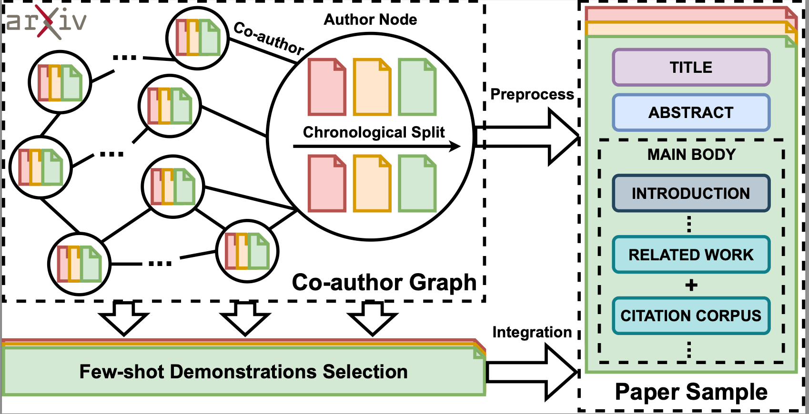

# AcademicEval: Live Long-Context LLM Benchmark


<div align=center>  </div>


**You can download our collected data at [AcademicEval-HF](https://huggingface.co/datasets/AcademicEval/AcademicEval)**


## Environment Setup

### Python Package

```bash
# python==3.10
pip install torch==1.12.1+cu113 torchvision==0.13.1+cu113 torchaudio==0.12.1 --extra-index-url https://download.pytorch.org/whl/cu113
pip install arxiv
pip install tqdm
pip install rouge_score
pip install textstat
pip install transformers
pip install langchain
pip install PyMuPDF
pip install faiss-gpu
pip install openai==0.28.0
```


### LLM Tokenizers

We additionally need the tokenizer configuration files for LLMs to ensure correct and accurate truncation.
- [Gemma](https://huggingface.co/google/gemma-7b-it)
- [LLaMA](https://huggingface.co/meta-llama/Llama-2-70b-chat-hf)
- [Qwen](https://huggingface.co/Qwen/Qwen1.5-72B-Chat)
- [Mixtral](https://huggingface.co/mistralai/Mixtral-8x7B-Instruct-v0.1)
- [Nous Hermes](https://huggingface.co/NousResearch/Nous-Hermes-2-Mixtral-8x7B-DPO)

You only need to download the tokenizer configuration files for each LLM, no model weight files are needed, because we access LLMs through the API. Please place the downloaded files in "gemma", "llama", "qwen", "mixtral", and "hermes" directories, respectively. 


## Experiments

**Note: Since we use the LLM API provided by [together.ai](https://www.together.ai/) to access LLMs, you need to prepare your own API KEY in the "get_llm_response_via_api" function in utils.py**

Please ensure that the AcademicEval is downloaded in the "AcademicEval" directory. The path should be like the following:


├── README.md
├── abs_extractor.py
├── bart_score.py
├── construct_relation_graph.py
├── exp_comparison.py
├── main.py
├── model.png
├── refine_graph.py
├── related_extractor.py
├── retrieval.py
├── section_region_extractor.py
├── utils.py
├── gemma
│   ├── ...
├── llama
│   ├── ...
├── qwen
│   ├── ...
├── mixtral
│   ├── ...
├── hermes
│   ├── ...
├── AcademicEval
│   ├── abs_9K
│   ├── abs_28K
│   ├── abs_29K_G
│   ├── intro_8K
│   ├── intro_28K
│   ├── intro_28K_G
│   ├── related_34K
│   ├── related_53K
│   ├── related_53K_G
│   ├── title_10K
│   ├── title_30K
│   └── title_31K_G


**Here are some command examples, you can run all the experiments by replacing "llm_model" and "setting", or adding "--rag" and "--retriever"**

```bash
# title-10K
python exp_comparison.py --setting title_10K --llm_model google/gemma-7b-it --cuda 3
# title-10K w/ RALM
python exp_comparison.py --setting title_10K --llm_model google/gemma-7b-it --cuda 3 --rag  --retriever contriever
# title-30K
python exp_comparison.py --setting title_30K --llm_model Qwen/Qwen1.5-72B-Chat --cuda 3
# title-31K-G
python exp_comparison.py --setting title_31K_G --llm_model Qwen/Qwen1.5-72B-Chat --cuda 3
```


## Benchmark Construction


**Coming Soon**

